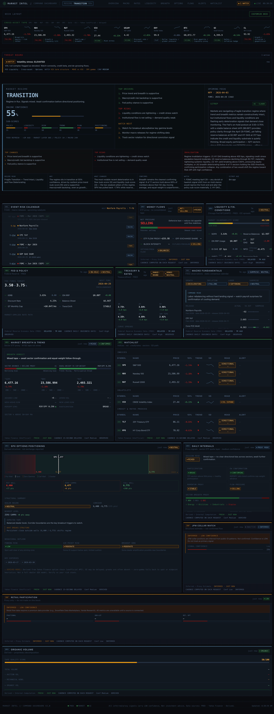

# Market Intelligence Dashboard

> Self-hosted market intelligence for independent traders and quantitative developers.  
> Aggregates Fed policy, Treasury rates, macro releases, liquidity, equity breadth, and options positioning into one command-center view.

[](LICENSE)
[](tsconfig.json)
[](src)
[](https://nextjs.org)

**Disclaimer:** This is **not financial advice**. The app is for education and research. Market data may be delayed, modeled, or unofficial — verify before acting.

**Yahoo Finance:** Quotes and options are fetched via community libraries (e.g. [`yahoo-finance2`](https://www.npmjs.com/package/yahoo-finance2)), not an official Yahoo partnership. Use is at your own risk; comply with [Yahoo’s applicable terms and policies](https://policies.yahoo.com/us/en/yahoo/terms/product-atos/apiforydn/index.htm). This project is **not affiliated** with Yahoo.

---

## Preview

<p align="center">
  
</p>

---

## Contents

- [Preview](#preview)
- [What it is](#what-it-is)
- [Why it exists](#why-it-exists)
- [Key features](#key-features)
- [Tech stack](#tech-stack)
- [Architecture overview](#architecture-overview)
- [Installation](#installation)
- [Environment variables](#environment-variables)
- [Running locally](#running-locally)
- [Project structure](#project-structure)
- [Deploying](#deploying)
- [Signal configuration](#signal-configuration)
- [Limitations and caveats](#limitations-and-caveats)
- [Roadmap](#roadmap)
- [Contributing](#contributing)
- [License](#license)
- [Acknowledgements](#acknowledgements)
- [Contributing](CONTRIBUTING.md) · [Security](SECURITY.md) · [Changelog](CHANGELOG.md)

---

## What it is

A self-hosted, single-user dashboard that pulls from public and semi-public APIs (FRED, Yahoo Finance, Polygon.io) and turns them into structured modules: Fed stance, Treasury curve regime, macro surprises, liquidity stress, breadth, flows, and options-style positioning.

It is **not** a trading system and does **not** output buy/sell signals. It is an **information and context** layer—the cross-asset picture institutions get from many terminals, without the same subscription cost.

## Why it exists

Macro context is expensive (Bloomberg, Refinitiv, etc.). Many retail tools show prices in isolation, without the policy, liquidity, and positioning backdrop that drives structural moves.

This project gives that layer to anyone who can run a Node.js app.

---

## Key features

### Market modules

| Area | What you get |
|------|----------------|
| **Fed / policy** | Target rate, balance sheet, QT pace, FOMC countdown, stance |
| **Treasury / rates** | Curve 3M–30Y, 2s10s / 2s30s, curve & rates regime |
| **Macro** | CPI, Core PCE, payrolls, unemployment, GDP, ISM—surprises & z-scores |
| **Liquidity** | SOFR, reserves, ON RRP, adjusted NFCI, HY/IG, VIX, vulnerability |
| **Equity breadth** | Sector 52w range, SPX/NDX/RUT, equal-weight read, tape quality |
| **Flows** | ETF dollar-volume proxy, futures pressure, off-exchange share |
| **Options** | SPX walls / zero-gamma heuristics when chain + OI (or greeks) exist |
| **Internals** | Proxy mode from sector ETFs when no exchange breadth feed |

### Dashboard intelligence

- **Regime engine** — Rule-based composite (policy, liquidity, risk, trend, flow, positioning) with confidence and drivers  
- **Alerts** — Threshold-based (rates, vol, FOMC, macro)  
- **AI briefing** — Optional Claude summary (Anthropic API)  
- **Command brief** — Top-level read: regime, drivers, risks, watch list  

### Architecture

- **Progressive loading** — Core (FRED + Yahoo quotes) first; options lane and sparklines follow; AI last  
- **Trust labels** — Metrics tagged `observed` / `derived` / `inferred` / `unavailable`  
- **Caching** — In-process TTL + stale fallback where applicable  
- **Layout** — `react-grid-layout` with persisted layout  

---

## Tech stack

| Layer | Technology |
|-------|------------|
| Framework | Next.js 14 (App Router) |
| Language | TypeScript (strict) |
| Styling | Tailwind CSS |
| Charts | Recharts |
| Layout | react-grid-layout |
| State | Zustand + SWR |
| Macro | FRED API (St. Louis Fed) |
| Market quotes / history | Yahoo Finance via [`yahoo-finance2`](https://www.npmjs.com/package/yahoo-finance2) |
| Options chain | Yahoo (`^SPX`) and/or Polygon.io |
| AI (optional) | Anthropic Claude |
| Tests | Vitest |

---

## Architecture overview

```text
Client (browser)
└── DashboardDeck (react-grid-layout)
    └── Module cards (FedCard, MacroCard, OptionsCard, …)

Server (Next.js API routes)
├── /api/dashboard/core       → FRED + Yahoo quotes + core regime (Tier 1)
├── /api/dashboard/options    → Options chain + regime refresh (Tier 2, often deferred)
├── /api/dashboard/sparklines → Yahoo chart history (Tier 2, parallel)
└── /api/ai/summary           → Claude briefing (Tier 3, TTL-cached)

Data layer
├── src/lib/sources/fred.ts
├── src/lib/sources/yahoo.ts
├── src/lib/sources/yahoo-options.ts
├── src/lib/sources/polygon-options.ts
└── src/lib/cache/server.ts

Signal layer
├── src/lib/features/
├── src/lib/regime/engine.ts
├── src/lib/alerts/
└── src/lib/config/thresholds.ts
```

---

## Installation

**Prerequisites:** Node.js 18.18+ and npm 9+

```bash
git clone https://github.com/your-username/market-intelligence-dashboard.git
cd market-intelligence-dashboard
npm install
cp .env.example .env.local
```

### Zero API keys (quick smoke test)

You can run **`npm run dev`** with **no** `.env.local` (or empty values): the UI loads with **placeholder** modules and clear empty states — useful to verify the install. Add **`FRED_API_KEY`** when you want live Fed / Treasury / macro / liquidity data; Yahoo market data stays available when `YAHOO_FINANCE_ENABLED` is not `false`.

---

## Environment variables

Configure **`.env.local`** (copy from **`.env.example`**).

### Minimum viable (free, macro + Yahoo market)

```bash
# Required for Fed / Treasury / Macro / Liquidity (free key)
FRED_API_KEY=your_fred_key_here   # https://fred.stlouisfed.org/docs/api/api_key.html

# Yahoo is on by default — no key
YAHOO_FINANCE_ENABLED=true
```

With only **`FRED_API_KEY`**, you still get Fed, Treasury, Liquidity, Macro, breadth, and flows fed from Yahoo quotes.

### Full optional stack

```bash
FRED_API_KEY=          # Macro / Fed / Treasury / liquidity series
ANTHROPIC_API_KEY=     # Claude briefing (optional)
POLYGON_API_KEY=       # Options with greeks (optional; Yahoo otherwise)
OPTIONS_CHAIN_SOURCE=  # auto | yahoo | polygon — see .env.example
```

> **No keys:** The app runs in **placeholder** mode: cards render with empty states; no crashes.

**SPX options on Yahoo:** use the **`^SPX`** chain. Do **not** set `YAHOO_OPTIONS_SYMBOL=^GSPC` for options—that ticker is the **spot index**; Yahoo returns a quote but **no option chain**. Default behavior uses `^SPX`.

Tuning (cache TTLs, rate limits, `DASHBOARD_OPTIONS_LOG`, etc.) is documented in **`.env.example`**.

---

## Running locally

```bash
# Development (default port 3001 via project script)
npm run dev

# Production
npm run build
npm start

# Tests
npm test

# Types
npx tsc --noEmit
```

Open **http://localhost:3001** (or the port printed in the terminal).

---

## Project structure

```text
src/
├── app/
│   ├── api/
│   │   ├── dashboard/core/
│   │   ├── dashboard/options/
│   │   ├── dashboard/sparklines/
│   │   └── ai/
│   └── page.tsx
├── components/
│   ├── ui/
│   ├── modules/
│   └── dashboard/
└── lib/
    ├── config/thresholds.ts
    ├── features/
    ├── sources/
    ├── regime/
    ├── alerts/
    ├── cache/server.ts
    ├── dashboard/
    ├── types/
    └── ai/
```

---

## Deploying

### Vercel

[](https://vercel.com/new/clone?repository-url=https%3A%2F%2Fgithub.com%2Fyour-username%2Fmarket-intelligence-dashboard&env=FRED_API_KEY,YAHOO_FINANCE_ENABLED&envDescription=See%20.env.example%20for%20all%20variables.)

Replace **`your-username`** in the button URL with your GitHub user or org after you publish the repo (or use **Import Project** in Vercel and paste your repository URL).

Deploy as a standard Next.js app. Set env vars in the project dashboard (see **`.env.example`**).

> **Cache:** The default cache is **in-process**. On serverless, instances may be cold; for shared cache across invocations, replace **`src/lib/cache/server.ts`** with Redis (or similar).

### Self-hosted

```bash
npm run build
PORT=3001 npm start
```

---

## Signal configuration

Thresholds and regime weights live in **`src/lib/config/thresholds.ts`**—single place to tune behavior:

```typescript
export const BREADTH = {
  ADVANCING_THRESHOLD: 60,
  DECLINING_THRESHOLD: 40,
  BROAD_MIN_SECTORS: 7,
  // ...
}

export const REGIME = {
  WEIGHTS: {
    policy: 0.15,
    liquidity: 0.20,
    risk: 0.20,
    trend: 0.20,
    flow: 0.10,
    positioning: 0.15,
  },
  // ...
}
```

---

## Limitations and caveats

This is **not financial advice**. Dashboards narrow information gaps; they do not remove model risk or bad regimes.

| Topic | Notes |
|--------|--------|
| **Macro / Fed** | FRED: official series; typical lag on dailies |
| **Equity quotes** | Yahoo unofficial client; delays possible; API can change |
| **Options** | Yahoo: OI-focused; greeks often thin—heuristics, not OPRA GEX. Polygon: needs entitled key for full chain |
| **Breadth** | From sector ETF 52w range—**not** NYSE A/D or % above 50dma |
| **Flows** | Proxies from price/volume—not ETF create/redeem |
| **AI** | Claude text is generative—verify before acting |
| **Retail flows** | Not wired—would need licensed vendors |

Anything labeled **proxy** or **derived** in the UI should not be read as exchange-grade data.

---

## Roadmap

See **`ROADMAP.md`** when present.

**Near-term ideas**

- Dockerfile for self-hosted deploy  
- Redis (or similar) for multi-instance cache  
- Configurable watchlist symbols  
- Export / share snapshot  
- WebSocket or push for fresher tiles  

**Longer-term / contributions**

- True A/D or breadth via a stocks API  
- Real ETF flow where licensing allows  
- Alert destinations (email, Slack, webhook)  
- Optional NDX / RUT positioning modules  

---

## Contributing

See **`CONTRIBUTING.md`**, **`CODE_OF_CONDUCT.md`**, and **`SECURITY.md`**.

```bash
git clone https://github.com/your-username/market-intelligence-dashboard.git
cd market-intelligence-dashboard
npm install
npm test    # all tests should pass before a PR
```

**Good first areas**

- Alert rules — `src/lib/alerts/`  
- Formatting helpers — `src/lib/format/`  
- Thresholds — `src/lib/config/thresholds.ts`  
- UI primitives — `src/components/ui/`  
- New sources — `src/lib/sources/` adapters  

### Maintainer: replace `your-username`

Before publishing, replace **`your-username`** with your GitHub user or org in:

- **`package.json`** — `repository`, `bugs`, `homepage`  
- **`README.md`** — clone URL above, **Deploy to Vercel** button (Deploying section)  
- **`CHANGELOG.md`** — optional compare/release link at the bottom  

---

## License

**MIT** — see **`LICENSE`**.

No affiliation with any bank, broker, or data vendor. Data comes from public or API-licensed sources. **Use at your own risk.**

---

## Acknowledgements

- **FRED** — Federal Reserve Economic Data (St. Louis Fed)  
- **yahoo-finance2** — Unofficial Yahoo Finance client  
- **Polygon.io** — Optional licensed market data  
- **Anthropic Claude** — Optional AI briefing  
- **react-grid-layout** — Dashboard layout  
